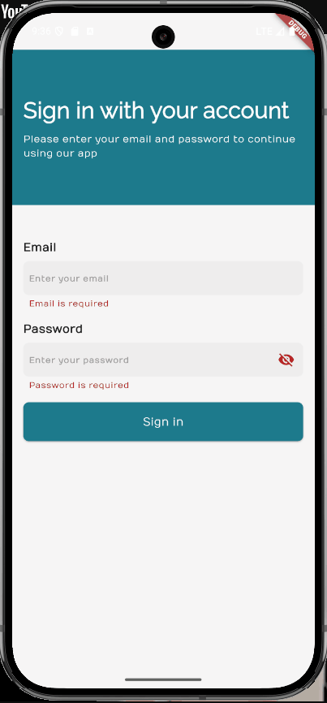
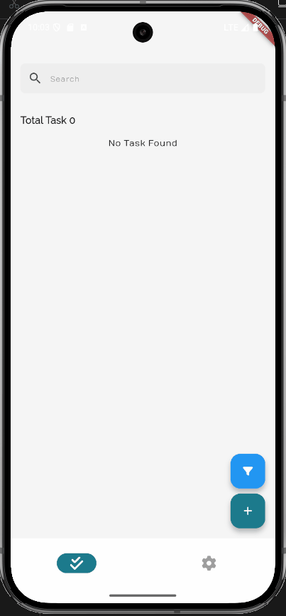
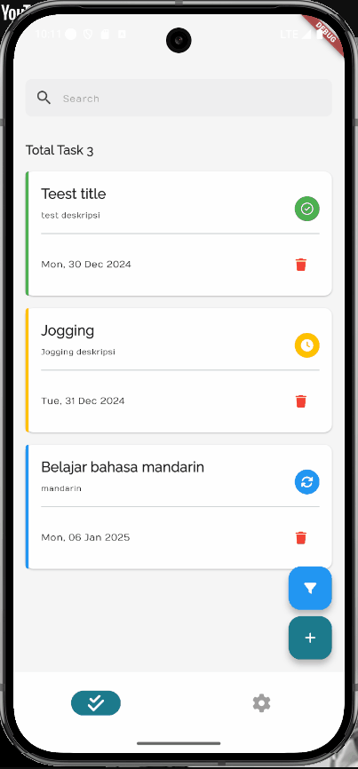

# Task Management (Technical Test Venteny Indonesia)

Task management for technical test Venteny Indonesia

## Run Locally

Clone the project

```bash
  git clone https://github.com/zgramming/technical-test-flutter-venteny-indonesia
```

Go to the project directory

```bash
  cd technical-test-flutter-venteny-indonesia
```

Install dependencies

```bash
  flutter pub get
```

Start application

```bash
  flutter run
```


## Features

- Onboarding screen
- Light/dark mode toggle
- Mock login using reqres.in
- Task management
- Schedule notification


## Running Tests

To run tests, run the following command

```bash
  flutter test
```


## Demo

| Onboarding | Login |
| ---------- | ----- |
|  |  |
| Form Task | Filter Task |
|  |  |
| Dark Mode | |
|  |

## Tech Stack

**Framework:** Flutter

**State Management:** Bloc (Cubit)

**Core Library:** go_router, flutter_bloc, sqflite, flutter_local_notifications, dartz, equatable 

## Authors

- [@zgramming](https://www.github.com/zgramming)